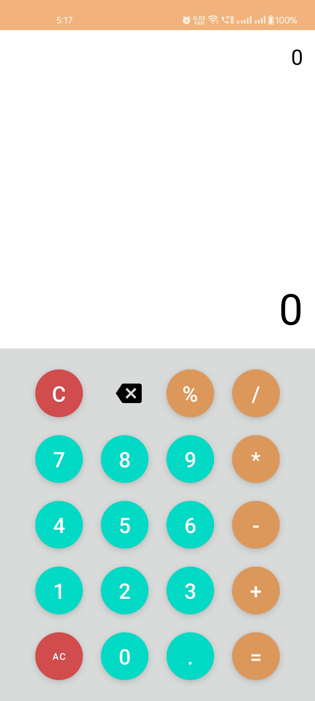
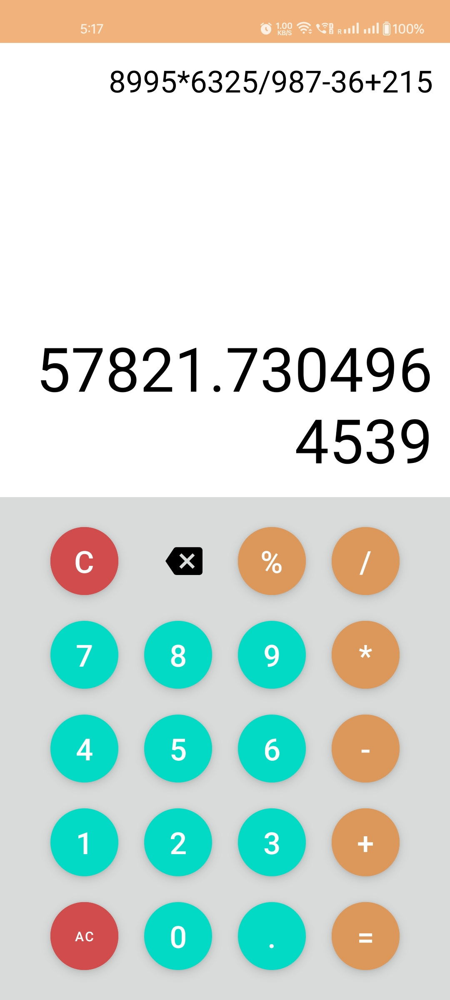
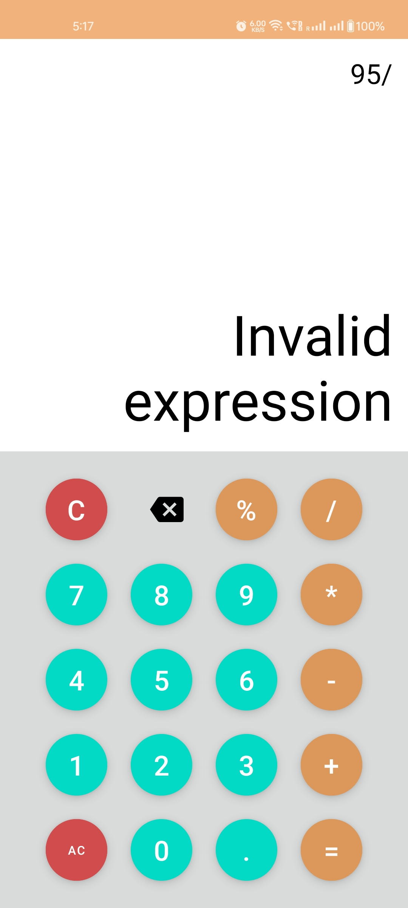
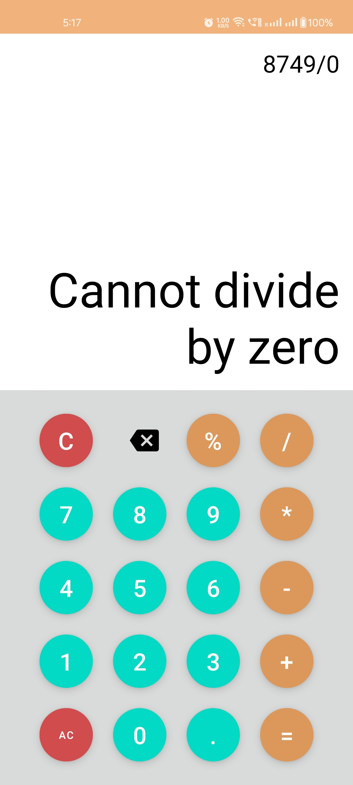

# Mini Calculator
Mini Calculator to perform operation like +,-,*,/ and %.

## Project Setup
1) Android Studio (> Giraffe)
2) Target SDk : 34
3) Java Version : 17
4) Gradle Version : 8.7

## Demo

{:width="200px"}

{:width="200px"}

{:width="200px"}

{:width="200px"}
